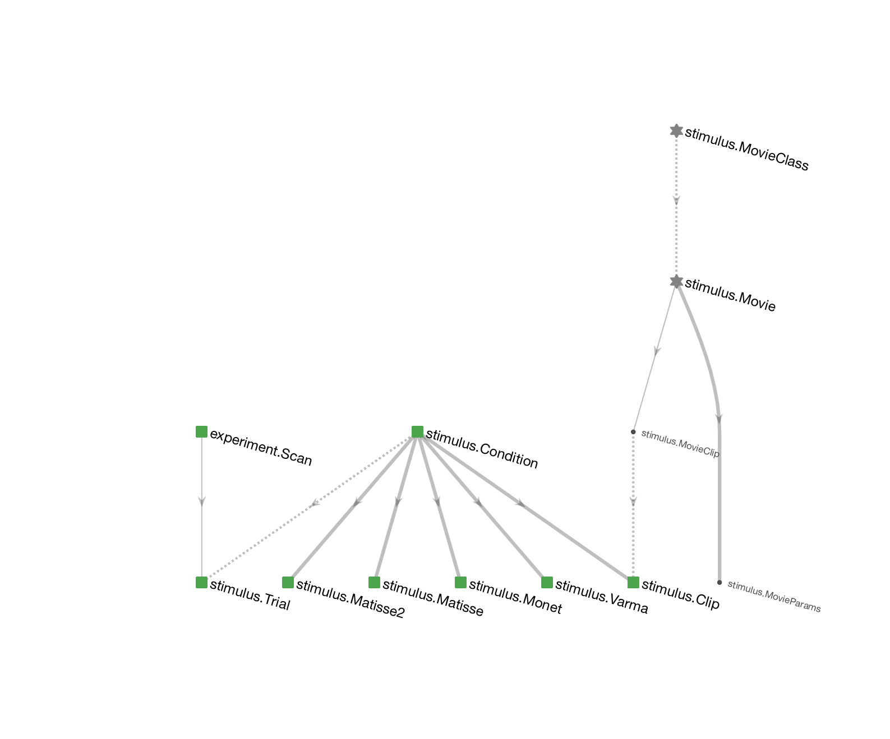
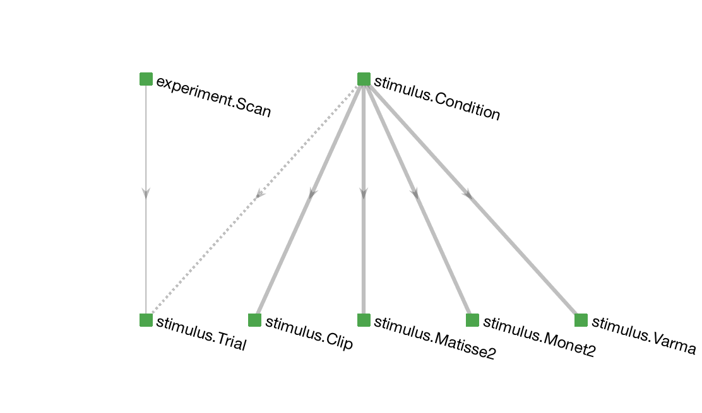

# Stimulus 
The `stimulus` schema is a self-contained application that generates, presents, and records visual stimuli using PsychToolbox.

# Run in MATLAB 
*Requirements:* Some of the stimuli require MATLAB R2016b+. 

Although the following steps steps can be executed manually, they are typically automated and thus serve as the application interface for the experiment control software.

## Step 1: Initialize screen
```
>> stimulus.open
```

## Step 2: Generate stimulus conditions and queue trials
Stimulus trials are generated and queued by the scripts in the `+stimulus/+conf` directory.  You need to know which configuration script needs to be run.

For example, to prepare the `matisse2` stimulus, execute 
```
>> stimulus.conf.matisse2
```

While the stimulus is loaded, you will see a sequence of dots `.` and asterisks `*`, which respectively indicate whether the conditions are computed anew or are loaded from the database.  Some stimuli take a long time to compute and you might like to run the configuration before you begin the experiment.  On subsequent runs, the computed stimuli will be loaded from the database and will not take as long.

## Step 3.  Run the stimulus 
The stimulus must be run for a specific scan in the `experiment.Scan` table.  
Table `experiment.Scan` contains a dummy entry that can be used for testing.  Its primary key is `struct('animal_id', 0, 'session', 0, 'scan_idx', 0)`.  During the experiment, the correct scan identification must be provided.

The following command will run the queued stimulus trials for the dummy scan. 
```
>> stimulus.run(struct('animal_id', 0, 'session', 0, 'scan_idx', 0))
```

## Step 4.  Interrupt and resume the stimulus
While the stimulus is playing, you can interrupt with `Ctrl+c`.  The stimulus program will handle this event, cancel the ongoing trial, and clear the screen.  To resume the stimulus, repeat the `stimulus.run` call above.  Or to queue a new set of trials, run the configuration script again.

## Step 5. Exit 
To close the stimulus program, 
```
>> stimulus.close
```

# Run in Python
The stimulus configuration and playback are written and executed in MATLAB.  However, the control software in our lab is written in Python. 

First configure the MATLAB Engine API for Python as described at https://www.mathworks.com/help/matlab/matlab_external/install-the-matlab-engine-for-python.html.

Upon installation, you can reproduce the steps above in Python as 
```python
import matlab.engine as eng
mat = eng.start_matlab()

# step 1: Initialize screen
mat.stimulus.open(nargout=0)            

# step 2: intialize conditions and queue trials
mat.stimulus.conf.matisse2(nargout=0)  

# step 3: run stimulus for the specific scan
f = mat.stimulus.run(dict(animal_id=0, session=0, scan_idx=0), nargout=0, async=True)

# step 4. Interrupt and resume stimulus
f.cancel()   # interrupt 
f = mat.stimulus.run(dict(animal_id=0, session=0, scan_idx=0), nargout=0, async=True)   # resume

# step 5. Exit 
f.done()  # True if stimulus is done
f.result()  # waits until the stimulus is done
f.stimulus.close(nargout=0)  # close the stimulus screen 
```

# Data structure 
The diagram below depicts the entire stimulus schema. 


The following diagram shows the core of the schema for a subset of stimulus types: 


### `stimulus.Condition`
The central table is `stimulus.Condition`, which enumerates all possible stimulus conditions to be presented. 
It is populated before the stimulus is presented for the first time.
The specialization tables below it contain parameters that are specific to each type of stimulus. 
For example, `stimulus.Monet2` contains parameters that are specific to a single stimulus condition of the type `Monet2`.
For each tuple in `stimulus.Condition`, exactly one of the specialization tables contains the corresponding entry.
The name of the specialization table is indicated in each row of `stimulus.Condition` in field `stimulus_type`. 

A preview of the `stimulus.Condition`:
```
>> stimulus.Condition

ans = 


Object stimulus.Condition

 :: stimulus condition ::

    CONDITION_HASH            stimulus_type          stimulus_version
    ______________________    ___________________    ________________

    '+0cObnxIHpoB5RKZJVYj'    'stimulus.Matisse2'    '1'              
    '+3o2cquPfKnts4Gmjwr4'    'stimulus.Matisse2'    '1'              
    '+9mOEvwZHyV2MiwRBsMy'    'stimulus.Varma'       '1'              
    '+9nMtSVLIPAj/VEmey+6'    'stimulus.Matisse'     '2'              
    '+9OAgABcltcbRZUw77Kt'    'stimulus.Matisse2'    '1'              
    '+A8FfGEWQNonM6RMmrTk'    'stimulus.Matisse2'    '1'              
    '+C/KYdzQvzn0jzQScSGy'    'stimulus.Matisse2'    '1'              
    '+cI6EqAdQgh2tyJ1eMzy'    'stimulus.Matisse'     '2'              
    '+eFINMa+jF58wHzuk9qQ'    'stimulus.Monet2'      'dimitri-1'      
    '+eK4n7czWTGRVKKh4EJO'    'stimulus.Matisse2'    '1'              
    '+f+o1UeO1AtHWPTo3vlc'    'stimulus.Matisse2'    '1'              
    '+h1WWj2NG6mjGFobRphN'    'stimulus.Matisse2'    '1'              
    '+HeQV7jovoXvymyCqYCP'    'stimulus.Matisse2'    '1'              

          ...
```

### `stimulus.Trial`
The table `stimulus.Trial` contains the information about the presentation of a condition during a specific scan (from `experiment.Scan`).  
Any number of conditions of any type can be presented during a scan and each condition may be displayed multiple times.

```
>> stimulus.Trial

ans = 


Object stimulus.Trial

 :: visual stimulus trial ::

    ANIMAL_ID    SESSION    SCAN_IDX    TRIAL_IDX        condition_hash        last_flip          trial_ts           flip_times
    _________    _______    ________    _________    ______________________    _________    _____________________    __________

    0            0          0            0           'Qjz5gJN2igKvsonApHO1'    21322        '2017-04-21 16:23:40'    '=BLOB='  
    0            0          0            1           'KMk2le1nd79vP4uhW+lG'    21324        '2017-04-21 16:23:42'    '=BLOB='  
    0            0          0            2           'd3TMSkOO74Y2QzRngY9r'    21325        '2017-04-21 16:23:43'    '=BLOB='  
    0            0          0            3           'EvIYjxUYNs2QOjjiXoFo'    21327        '2017-04-21 16:23:45'    '=BLOB='  
    0            0          0            4           '8hPjQGXtiY7VJdmWBJhz'    21328        '2017-04-21 16:23:46'    '=BLOB='  
    0            0          0            5           'koXklHGOKSXzqG4vgeKw'    21330        '2017-04-21 16:23:48'    '=BLOB='  
    0            0          0            6           '9vYRXrkmZd1mi6oFcBAC'    21332        '2017-04-21 16:23:49'    '=BLOB='  
    0            0          0            7           'Yj+hNG8q+V2Icr+GW5WT'    21333        '2017-04-21 16:23:51'    '=BLOB='  
    0            0          0            8           'idP7ku8g2U51r28Hb6Nb'    21335        '2017-04-21 16:23:52'    '=BLOB='  
    0            0          0            9           'mzrmJBasIquICcmTK8K7'    21336        '2017-04-21 16:23:54'    '=BLOB='  
    0            0          0           10           'hp9b+CKb/QgV1O6B5gk+'    21338        '2017-04-21 16:23:55'    '=BLOB='  
    0            0          0           11           'lA4QZVp/vl9JxiH3JH8Y'    21339        '2017-04-21 16:23:57'    '=BLOB='  
    0            0          0           12           'H+w/IuPACeCuzUziOIfi'    21341        '2017-04-21 16:23:58'    '=BLOB='  

          ...
```

## Example queries
If the language is unspecified, the queries run in both MATLAB and Python.

### All scans with any visual stimuli
```
visualScans = experiment.Scan() & stimulus.Trial()
```

### All scans with the `Monet` stimulus:
```
monetScans = experiment.Scan() & (stimulus.Trial() * stimulus.Monet())
```
or
```
monetScans = experiment.Scan() & (stimulus.Trial() * stimulus.Condition() & 'stimulus_type="stimulus.Monet"')
```

### All unique conditions shown during a given scan

```python
# python
scan_key = dict(animal_id=7302, session=1, scan_idx=3)
scan_conditions = stimulus.Condition() & (stimulus.Trial() & scan_key)
```

```matlab
% matlab
scanKey = struct('animal_id', 7302, 'session', 1, 'scan_idx', 3);
scanConditions = stimulus.Condition & (stimulus.Trial & scanKey);
```


### All stimuli types shown during a given scan
```python
# python
scanKey = dict(animal_id=7302, session=1, scan_idx=3)
scan_stimuli = dj.U('stimulus_type') & (dj.Condition() * dj.Trial() & scanKey)
```

# Designing configurations
TODO
# Designing new stimuli
TODO
